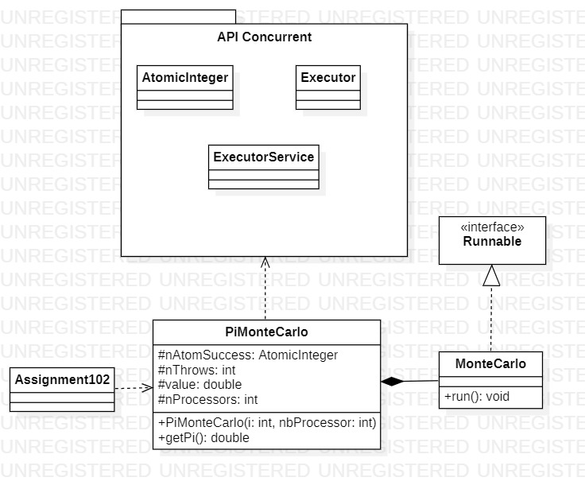

Enzo GUIGNOLLE

<div align="center">

</div>

# Compte-Rendu des TPs

### [Introduction](#p1)
### [I/ Méthode de Monte Carlo](#p2)
### [II/ Algorithme et parrallélisation](#p3)
### [III/ Mise en oeuvre sur machine à mémoire partagée](#p4)
- #### [A/ Assignment102.java](#a)
- #### [B/ Pi.java](#b)
### [IV/ Mise en oeuvre en mémoire distribué](#p5)
### [V/ Evaluation et test de performance](#p6)
- #### [A/ Contexte](#a)
- #### [B/ Réalisation des tests](#b) 
  - #### [a/ Evaluation du Speed Up](#b1)
  - #### [b/ Evaluation de l'écart de Pi](#b2)

<br>

------------

# <a name="Ip1"></a> Introduction 

Ce document permet de synthétisé ce que j'ai pu réalisé durant les séances de Programmation avancée. Vous retrouverez les différents tests de performance des codes présenté durant ce rapport mais aussi les explications et la manière de réfléxion qu'il y a eu durant ces différentes séance de TP

## <a name="p2"></a> I/ Méthode de Monte Carlo

Durant la première séance de TP sur la méthode de Monte Carlo nous avons eu un cours sur ce qu'était la méthode et comment elle fonctionne pour d'approximer Pi. Je vais maintenant expliqué brièvement la méthode. La méthode de Monte Carlo est une méthode qui permet d'approximer Pi grâce au probabilité. Donc on prend un quart de cercle qui a pour rayon ```r=1``` dont l'aire est ```A = (pi*r**2)/4 = pi/4```. Après on prend un carré avec un coté de la taille du rayon du cercle ```c=1``` avec l'aire qui est ```Ac =c**2=1```. Ensuite on tire aléatoirement plusieurs points ```Xp=(xp,yp)``` et chaque coordonnée des points est tirée par une loi Uniforme ```U(]0,1[)```. Ensuite la probabilité que les points soit tirée dans le quart de cercle est ```P=A/Ac=pi/4```. <br>
Voici un schéma représentant cette méthode : 


Ensuite pour appoximer Pi on doit réaliser *ntot* tirage aléatoire de point. Ensuite on compte le nombre de point tombé dans le quart de cercle qu'on peut noter *ncible*. Maintenant on peut approcimer P par ```P = ncible/ntot = pi/4```. Grâce à cette formule pour approximer Pi on doit multiplier par 4 donc ça donne ```pi = (4*ncible)/ntot```. Donc maintenant nous pouvons approximer Pi.

## <a name="p3"></a> II/ Algorithme et parrallélisation

Après avoir réaliser cela nous devions réfléchir à des algorithme en pseudo-code pour réaliser la méthode de Monte Carlo tout en faisant de la programmation parallèle. Donc on avait réfléchi au modèle de parallélisme que cela pouvait être et nous avions décidé que c'étais un parallélisme de tâche. Ensuite nous devions identifier les différentes tâches que nous avions dans la méthode. Nous avions trouver ces tâches:
- T0 : tirer et compter ntot points
- T1 : calculer Pi <br>

On pouvait ensuite encore décomposer la tâche T0 en sous-tâche : 
- T0p1 : Tirer xp
- T0p2 : Incrémenter ncible <br>

Ensuite nous devions trouver les dépendances de tâches pour savoir quels tâches pouvait être fait en parallèle. Donc nous avion vu que T1 dépendait de T0 mais que les sous-tâches de T0 était indépendantes. Cependant dans les sous-tâches nous avons T0p2 qui dépend de T0p1. <br>
Après nous devions déterminer la ressource critique et la section critique, qui sont pour la ressource critique ncible et la section critique l'incrémentation de ncible.
Après nous devions réfléchir à des pseudo-code pour faire ces codes avec les paradigmes qui sont **Master/Worker** et **itérations parallèles**.
Avant de vous mettre les différents pseudo-code je vais expliquer rapidement le paradigme Master/Worker.

### Explication du paradigme Master/Worker

Pour comprendre le fonctionnement du paradigme Master/Worker voici un schéma qui résume : 


Donc le paradigme Master/Worker fonctionne de la manière suivante. Un programme fait office de Master c'est-à-dire que qu'il envoie des données que le Worker doit traiter pour réalisé ce qu'il lui a été attribué. Un fois que le Worker à réalisé ce qu'il lui a été attribué il renvoie ces résultat au Master qui analyse les données et les utilise pour finir ce qu'il doit faire.

Maintenant je vais expliquer les algorithme en pseudo-code que nous avons du réaliser ci-dessous : 

### a) Pseudo-code itération parallèle

Comme pseudo-code pour le paradigme des itérations parrallèles nous avons fait cela :

```
initialiser n_cible à 0

pour p allant de 0 à n_tot-1

    xp = valeur alléatoire en 0 et 1
    yp = valeur alléatoire en 0 et 1

    si (xp au carré + yp au carré) inferieur à 1
        ajouter 1 à n_cible
    fin si

fin pour

calculer pi = 4 * n_cible / n_tot
```

Dans ce pseudo-code qui aurait pu être réalisé en parrallèle nous aurions eu comme section critique toute la condition if et comme ressource critique nous aurion bien sur ajout de 1 à n_cible.

### b) Pseudo-code Master/Worker

Comme pseudo-code pour le paradigme Master/Worker nous avons du réaliser le pseudo-code pour le Master mais aussi pour le Worker voilà ce que cela donne : 

- En premier nous allons voir le pseudo-code pour le Worker
```
Worker_MC : parametre(n_tot)
    initialiser n_cible à 0

    pour p allant de 0 à n_tot-1

        xp = valeur alléatoire en 0 et 1
        yp = valeur alléatoire en 0 et 1

        si (xp au carré + yp au carré) inferieur à 1
            ajouter 1 à n_cible
        fin si

    fin pour

revoyer n_cible
```

- Maintenant nous allons voir le pseudo-code pour le Master
```
Master_MC
    n_tot[nb_worker]
    initialiser n_CibleSomme à 0

    pour i allant de 0 à nb_worker-1
        n_tot[i] = n_total/nb_worker
        n_cible[i] = Worker_MC[i](n_tot[i]).start
    fin pour

    n_CibleSomme = somme de toutes les éléments n_cible
    pi = 4 * n_CibleSomme/n_total
```

## <a name="p4"></a> III/ Mise en oeuvre sur machine à mémoire partagée

Après avoir réalisé cela, deux codes nous a été fournie, Assignment102.java et Pi.java et nous devions les analysé chacun pour savoir comment ils implémentait Monte Carlo.

### <a name="a"></a> A/ Assignment102.java

Dans ce code nous avons remarquer qu'il utilisait différentes classes de l'API Concurrent dont la classe AtomicInteger, ExecutorService et Executors. Nous avons aussi remarqué que nAtomSuccess représentait le nCible que nous avions choisis durant la conception de nos codes et que nThrows est le nTotal que nous avions choisis.<br>
Ensuite nous avons analyser le code et ce que chaque classe servait. Nous avons vu que le code utilisait la méthode incremantAndGet() de la classe AtomicInteger ce qui permet d'incrémenter de 1 au nombre.<br>
Nous avons aussi souligner que la classe MonteCarlo compose la classe PiMonteCarlo car c'est une classe qui est créer elle-même dans un autre classe.<br>
Nous avons aussi déduis que *value* en étant de type double doit représenter le nombre pi quand il est calculer.<br>
A la suite de cela nous avons vu qu'un ExecutorService était déclarer mais avant de cela, nous avons la récupération du nombre de Processeur dans l'ordinateur qui exécute le code. Puisque nous avons RunTime qui représente l'environnement d'exécution et il ne faut pas le confondre avec le CPUTime qui représente le temps d'exécution.<br>
Ensuite il prépare une workStealingPool avec le nombre de processeur récupérer qui permet de réaliser le vol de tâche c'est-à-dire qu'un processeur peut récupérer une tâche quand la tâche qui l'a est bloqué ou terminer.
Nous avons terminer l'analyse de ce code par dire qu'il représentait le paradigme des itérations parallèles car nous avons une boucle qui lance tout les itérations de MonteCarlo qui sont des Runnable.
De plus nous avons appris que l'executor permet de réaliser ce que l'on faisait quand on associait un Runnable avec un Thread durant les premiers TP.<br>
On peut ensuite améliorer le code pour éviter que trop de processus doivent passer par la section critique et nous avons penser à regarder les points qui tombe hors du quart de cercle et de calculer la différence. Cela optimisera les calculs en parallèles car nous avions vu que seulement 75% des points tombait dans le cercle donc que 75% des processus allait devoir passer par la section critique alors qu'avec cette nouvelle façon seulement 25% doivent passer pas la section critique. Il suffira juste de modifier le calcul de Pi pour trouver la bonne valeur.
Voici le diagramme de classe du code de Assignment102.java après avoir réalisé l'analyse du code : 



### <a name="b"></a> B/ Pi.java

* #### a) Explication de la classe Future 

La classe Future permet de gérer des calculs asynchrone, elle permet de faire des tâches en arrière plan. On l'utilise souvent pour récupérer les résultats des Callable en utilisant la méthode get de la classe Future et on peut aussi voir si la tâches est terminée ou pas

* #### b) Analyse du code Pi.java

Nous allons maintenant analyser le code Pi.java avant de réalisé le diagramme de classe
Dans Pi.java nous avons vu qu'il utilisait plusieurs classes comme Future, ExecutionExeption ou encore Executor mais aussi une interface Callable qu'on nous a introduit précedemment qui font tous partie de l'API Concurrent. 
Nous avons ensuite vu qu'il y avait deux classe principale qui sont la classe Master et Worker. Nous avons commencer par analyser la classe Master. Dans la classe Master nous avons vu qu'il y a une instanciation d'une liste de Callable, qui est la pour instancier les différents Worker qui vont être instancié. Ensuite dans le code nous avons pu voir une boucle qui parcours la liste de résultat des workers qui est une liste de Future défini précedemment. Ensuite on a essayer de savoir ce qu'était totalCount et nous avons dit que c'est le total de point qu'un Worker doit faire et que la variable total est le résultat de points qui sont dans la cible. Et nous avons fini par remarquer qu'au moment du calcul de Monte Carlo il fallait diviser par le nombre de Worker.
Nous avons ensuite regarder la classe Worker, qui implément l'interface Worker avec la classe Long qui est une classe générique. Nous avons ensuite vu que la classe exécutait la boucle de Monte Carlo avant de renvoyer le résultat au Master.
Nous avons fini par conclure cette analyse par dire que le paradigme de programmation parrallèle de ce code est Master/Worker expliquer dans la partie II.
Maintenant voici le diagramme de classe de Pi.java suite à son analyse.


<br><br>

## <a name="p5"></a> IV/ Mise en oeuvre en mémoire distribué

Pour réaliser Monte Carlo en mémoire distribué, il a été utilisé le paradigme Master/Worker pour comprendre comment cela fonctionne voici un schema qui synthétise son fonctionnement : 


Donc ce code permettra de faire en sorte que un Master soit sur une machine avec un certain nombre de Worker mais que d'autre Worker soit sur d'autre machine et qu'il puissent communiqué par envoie de message avec la machine qui contient le Master. De plus le paradigme fonctionne comme pour Pi.java donc je n'ai aps besoin d'expliquer de nouveau cela.<br>
Ensuite un code permettant de réalisé la méthode de Monte Carlo en mémoire distribué, nous a été fourni. Voici le diagramme de classe du code en question:


Ce code est composé de deux classes : MasterSocket et WorkerSocket. De plus, il utilise la méthode des sockets pour réaliser ce programme en mémoire distribuée. C'est-à-dire qu’un socket est un petit fichier contenant les données dont un autre programme peut avoir besoin pour s’exécuter. Après avoir analysé le code, nous devions intégrer la boucle de Monte Carlo dans la classe WorkerSocket. 
Pour pouvoir exécuter le code dans les bonnes conditions, nous devons passer un argument à la classe WorkerSocket afin qu’elle puisse définir le port à écouter pour l’envoi de messages. Ensuite, en exécutant la classe MasterSocket, nous devons spécifier le nombre de Worker que nous voulons utiliser ainsi que les différents ports à utiliser pour envoyer les messages.<br><br>
À la suite de cela, nous pouvons également faire de la programmation parallèle multi-niveau, c’est-à-dire que chaque WorkerSocket peut créer des Worker sur sa propre machine, comme dans Pi.java, et calculer les points de ces Worker qui les envoient ensuite au MasterSocket, comme prévu.

## <a name="p6"></a> V/ Evaluation et test de performance

###  <a name="a"></a> Contexte

Dans cette partie de mon rapport nous allons voir la qualité de chaque code au sens de la norme ISO/IEC 25010. Dans cette norme, nous allons nous concentrer sur la section "Quality in use" et dans cette section, nous allons nous concentrer sur la partie sur l'efficiency que nous pouvons retrouver dans la norme ISO/IEC 25022. Dans cette norme, il nous parle de plusieurs temps à analyser. 

#### Time 

Pour calculer la variable Time pour l'efficiency nous devons faire ce calcul : 

```
Time  = T_target / T_actual
```

#### Task Time

Ensuite nous avons la variable task time dont la formule pour le calculer est : 

```
Task Time = (T_target - T_actual) / T_target
```

A la suite de cela nous avons deux possibilité pour analyser les codes : 

- La première possibilité que nous avons, c'est de comparer le code parallèle au code séquenciel. Dans ce cas la nous avons T_target = Temps_1_processeur et nous avons T_actual = T_n_processeurs ce qui nous permet de calculer le speed up et de évaluer la courbe.

- La deuxième possibilité c'est de considérer qu'on a un parallélisme idéal, c'est de qu'on cible. Dans ce cas nous T_target = T_n_processeurs et nous avons T_actual = T_n_processeurs_chapeau où T_n_processeurs_chapeau le temps en scalabilité forte T_n_processeur = (1/p)*T_1_processeur. Grâce à cela nous allons évaluer l'écart avec la courbe de speed Up.

Avant de préparer et réalisé les différents tests de performance, je vais donné les différentes spécifications de l'ordianteur qui les aura réalisé. Cependant il est évident que les tests seront différents sur d'autre architecture matérielle.

- Processeur : Intel® Core™ i7-9700 CPU @ 3.00GHz
- Nombre de coeur physique : 8
- Nombre de coeur logique : 8
- Mémoire RAM : 32 Go

De plus je vais rapidement expliquer ce qu'est la scalabilité forte et faible. La scalabilité forte permet de voir si le speed up augmente en laissant le nombre de points max à calculer dans ce cas mais qu'on augmente le nombre de processeur utilisé ce qui fait que le nombre de point par processeur diminue au fur et à mesure. La scalabilité faible est le faite de voir si le speed Up reste autour de 1 en laissant fixe le nombre de point par processeur mais d'augmenter le nombre de point max à calculer mais aussi le nombre de processeur utilisé.
Pour pouvoir réalisé les courbes de la scalabilité forte mais aussi faible nous allons devoir calculé le speed up de chaque test. Pour calculer le speed up nous devons utilisé cette formule :

```
SpeedUp = Temps_1_processeur / Temps_n_processeurs
```

Ensuite pour savoir si les speed up calculer après test de chaque programme soit optimal, nous allons nous fier à ce schéma : 


Pour avoir un speedUp optimal il faut que la courbe soit linéaire, c'est à dire que le speed up soit proportionnel en fonction du nombre de processeur comme le speed up de 1 processeur sera toujours 1, il faut que le speed up à N processeurs soit équivalent à 1*N.

###  <a name="b"></a> Réalisation des tests

Dans cette sous partie nous allons nous consacrer à la préparation et à la réalisation des tests. Donc nous allons faire les 2 possibilités énoncé plus haut donc nous allons commencer par l'évaluation du speed up et nous allons ensuite évalué l'écart du speed up avec l'erreur relative de chaque tests réalisé.

###  <a name="b1"></a> a/ Evaluation du Speed Up

### Assignment102.java

#### Scalabilité Forte

| Nombre total de points  | Nombre de point par processeur  | Nombre de processeur utilisable | Temps d'exécution  |
|-------------------------|---------------------------------|---------------------------------|--------------------|
| 10000000                | 10000000                        | 1                               | 667 ms             |
| 10000000                | 5000000                         | 2                               | 790 ms             |
| 10000000                | 2500000                         | 4                               | 849 ms             |
| 10000000                | 1250000                         | 8                               | 1121 ms            |
| 10000000                | 625000                          | 16                              | 2241 ms            |

Après avoir réalisé les tests et calculer le speedUp cela nous donne une courbe de cette manière : 


#### Scalabilité Faible

| Nombre total de points  | Nombre de point par processeur  | Nombre de processeur utilisable | Temps d'exécution |
|-------------------------|---------------------------------|---------------------------------|-------------------|
| 10000000                | 10000000                        | 1                               | 668 ms            |
| 20000000                | 10000000                        | 2                               | 1520 ms           |
| 40000000                | 10000000                        | 4                               | 3202 ms           |
| 80000000                | 10000000                        | 8                               | 6239 ms           |
| 160000000               | 10000000                        | 16                              | 13880 ms          |

Après avoir réalisé les tests et calculer le speedUp cela nous donne une courbe de cette manière : 


### Pi.java

#### Scalabilité Forte

| Nombre total de points  | Nombre de point par processeur  | Nombre de processeur utilisable | Temps d'exécution |
|-------------------------|---------------------------------|---------------------------------|-------------------|
| 10000000                | 10000000                        | 1                               | 326 ms            |
| 10000000                | 5000000                         | 2                               | 172 ms            |
| 10000000                | 2500000                         | 4                               | 95 ms             |
| 10000000                | 1250000                         | 8                               | 59 ms             |
| 10000000                | 625000                          | 16                              | 68 ms             |

Après avoir réalisé les tests et calculer le speedUp cela nous donne une courbe de cette manière : 


#### Scalabilité Faible

| Nombre total de points  | Nombre de point par processeur  | Nombre de processeur utilisable | Temps d'exécution |
|-------------------------|---------------------------------|---------------------------------|-------------------|
| 10000000                | 10000000                        | 1                               | 326 ms            |
| 20000000                | 10000000                        | 2                               | 330 ms            |
| 40000000                | 10000000                        | 4                               | 336 ms            |
| 80000000                | 10000000                        | 8                               | 359 ms            |
| 160000000               | 10000000                        | 16                              | 716 ms            |

Après avoir réalisé les tests et calculer le speedUp cela nous donne une courbe de cette manière : 


### Calcul distribué

A la suite des tests des codes en mémoire partagé nous devions analyser le code qui permet de réalisé Monte Carlo en mémoire distribué.
Pour pouvoir l'analyser nous devions réalisé la courbe de speed up pour la scalabilité faible et la scalabilité forte donc les données récupérer durant l'experience sont ci-dessus.

#### Scalabilité Forte

| Nombre de machine | Nombre total de points | Nombre de point par processeur | Nombre de processeur utilisable | Temps d'exécution |
|-------------------|------------------------|--------------------------------|---------------------------------|-------------------|
| 1                 | 192000000              | 192000000                      | 1                               | 5873              |
| 1                 | 192000000              | 48000000                       | 4                               | 1506              |
| 2                 | 192000000              | 24000000                       | 8                               | 756               |
| 3                 | 192000000              | 16000000                       | 12                              | 508               |
| 4                 | 192000000              | 12000000                       | 16                              | 385               |
| 6                 | 192000000              | 8000000                        | 24                              | 267               |
| 8                 | 192000000              | 6000000                        | 32                              | 206               |
| 12                | 192000000              | 4000000                        | 48                              | 133               |

D'après ce tableau nous obtenu un courbe de speed up pour la scalabilité forte du code en mémoire distribué qui ressemble à cela : 


#### Scalabilité Faible

| Nombre de machine | Nombre total de points | Nombre de point par processeur | Nombre de processeur utilisable | Temps d'exécution |
|-------------------|------------------------|--------------------------------|---------------------------------|-------------------|
| 1                 | 4000000                | 4000000                        | 1                               | 129               |
| 1                 | 16000000               | 4000000                        | 4                               | 140               |
| 2                 | 32000000               | 4000000                        | 8                               | 143               |
| 3                 | 48000000               | 4000000                        | 12                              | 136               |
| 4                 | 64000000               | 4000000                        | 16                              | 134               |
| 6                 | 96000000               | 4000000                        | 24                              | 139               |
| 8                 | 128000000              | 4000000                        | 32                              | 140               |
| 12                | 192000000              | 4000000                        | 48                              | 141               |

D'après ce tableau nous obtenu un courbe de speed up pour la scalabilité faible du code en mémoire distribué qui ressemble à cela : 


###  <a name="b2"></a> b/ Evaluation de l'écart de Pi

Dans cette sous partie, nous allons voir comment l'erreur diminue au fur et à mesure qu'on augmente le nombre d'itération dasn les tests. En premier j'ai réalisé les tests de Pi.java.
Pour réalisé cela nous devons calculer l'erreur relative pour chaque itération de Monte Carlo réalisé sur un nombre de point réalisé. C'est à dire que le calcul à réalisé est le suivant : 

```
Erreur relative = (valeur réel de Pi - valeur calculer de pi)/valeur réel de Pi
```

Après avoir faire le calcul pour chaque itération nous pouvons réalisé un graphique de l'erreur relative en fonction du nombre d'itération. Nous sommes censé remarqué que plus le nombre de points calculer pour Pi, l'erreur est censé diminuer et se rapprocher de 0.
Pour le code Pi.java nous obtenons un nuage de point qui ressemble à cela :


Nous remarquons quand même que les nuages de points pour chaque itération diminue bien, donc que l'erreur se rapproche de 0.
Nous pouvons aussi remarqué que les erreurs diminue lentement en fonction du nombre d'itération si nous réalisons la médiane de chaque erreur représenter par les points rouges. 

